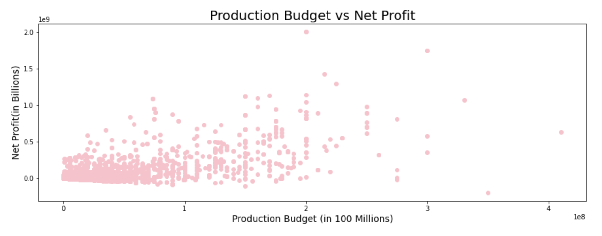

# Microsoft Movie Studio
***
**Author: Deanna Gould**
## Overview
***
This project analyzes what aspects are most important in a movie to determine where [Microsoft](https://news.microsoft.com/facts-about-microsoft/#BOD) should allocate their resources. Microsoft is a technology company based in Redmond, Washington that specializes in producing computer software, consumer electronics, and gaming as well. Now, Microsoft is also interested in entering the entertainment industry.

## Business Problem
***
Since Microsoft doesn't have experience in the Entertainment industry, they've hired me as a consultant to do some analysis and create a model to determine what makes a movie most successful. This analysis will help Microsoft properly allocate their resources and determine what they would like to focus on in their movie.

## Data
***
The data used in this analysis has been retrieved from [IMDb](https://www.imdb.com/) which is an acronym for Internet Movie Database. IMDb mainly stores information for movies and television shows about the cast and crew behind the movie or show. IMDb is actually a subsidiary of Amazon, and began when Col Needham, a software engineer, started storing data about all of the films he had seen.

## Methods
***
This project uses descriptive analysis to summarize information and identify patterns in successful movies. The results are then shown in easy to read visualizations based on the relationships and variables created.

## Results
***
While there are many movie genres, **Action** is the top grossing movie genre worldwide.

Action has more than double the worldwide gross revenue of any other genre. In addition to genre, the directors matter as well. A director's success was evaluated by rating of their movies.

How much money a movie makes can also be predicted by how much was invested into the movie, also known as the production budget. The scatter plot below shows multiple data points with a movie's production budget and the worldwide gross.

## Conclusions
***
- In conclusion, Microsoft should create an **Action** movie to earn the highest worldwide gross possible. 
- Microsoft should focus on hiring directors who produce high ratings. Based on this analysis I recommend Microsoft hires **Shogo Kusano** or **Navot Papushado**.
- Microsoft should consider spending at least **2 million** on the production of this movie. 

### Next Steps
Deeper analysis could show more trends in different aspects of movies like release date or run time.
- **Better prediction of successful movies.** This modeling uses data that is readily available on IMDb, and could be adjusted for more recent movies as well.

- **Better prediction of unsuccessful movies.** This analysis could also identify movies that will be unsuccessful. Or, if there are limitations such as budget, diagnose where resources could be allocated to create a high rating movie.

## For More Information
***
See the full analysis in the [Jupyter Notebook](https://github.com/deannagould/microsoft-movie-studio/blob/main/dsc-phase1-project-template-checkpoint.ipynb) or revew this [presentation.](http://localhost:8889/files/MM%20Presentation.pdf)
For additional info, contact Deanna Gould at [deannagould4@gmail.com](deannagould4@gmail.com)

## Repository Structure

├── MM Presentation.pdf
├── README.ipynb
├── README.md
├── budget-gross.png
├── microsoft.png
├── movie-analysis.ipynb
├── movie_set.png
├── top-directors.png
├── top-genres.png
└── zippedData
    ├── bom.movie_gross.csv.gz
    ├── im.db
    ├── im.db.zip
    ├── rt.movie_info.tsv.gz
    ├── rt.reviews.tsv.gz
    ├── tmdb.movies.csv.gz
    └── tn.movie_budgets.csv.gz
