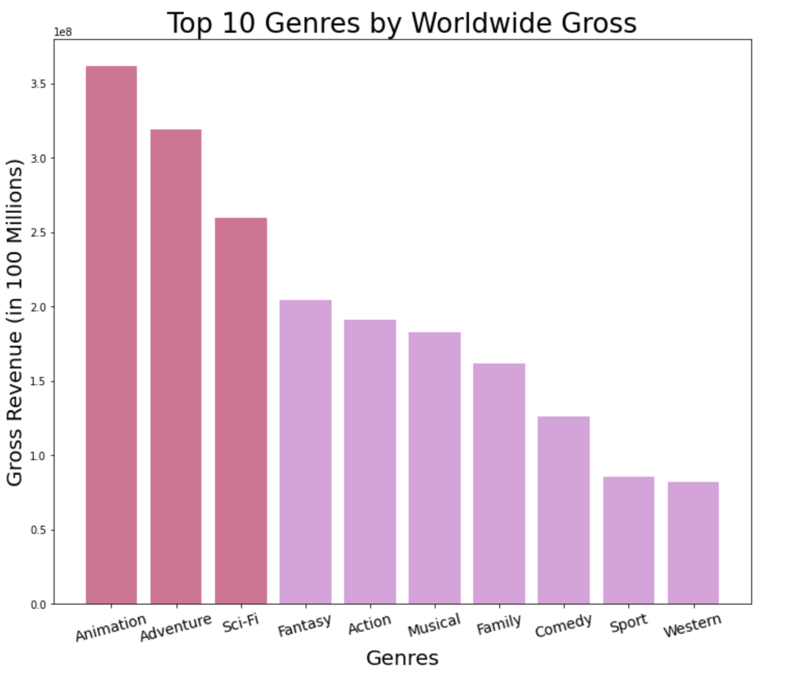
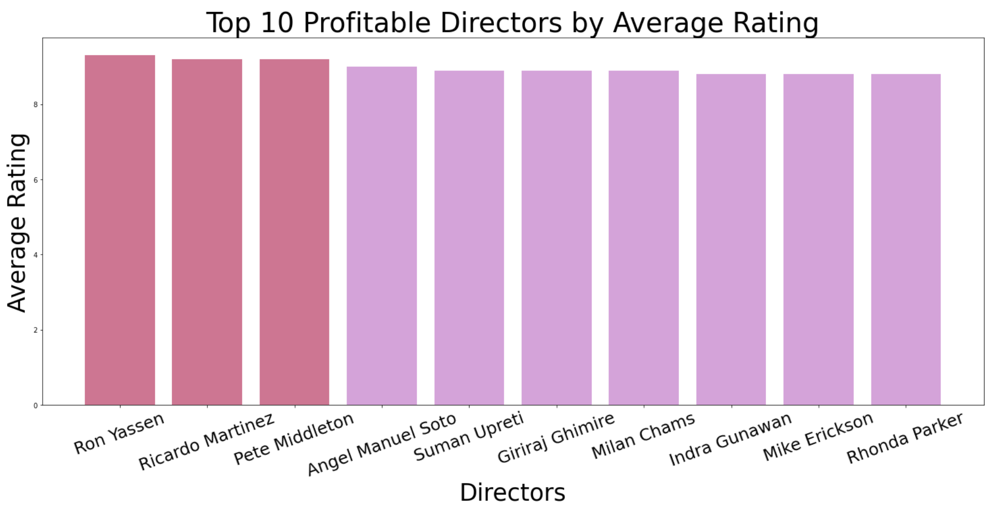

# Microsoft Movie Studio
***
**Author: Deanna Gould**
## Overview
***
This project analyzes what aspects are most important in a movie to determine where [Microsoft](https://news.microsoft.com/facts-about-microsoft/#BOD) should allocate their resources. Microsoft is a technology company based in Redmond, Washington that specializes in producing computer software, consumer electronics, and gaming as well. Now, Microsoft is also interested in entering the entertainment industry.

## Business Problem
***
Since Microsoft doesn't have experience in the Entertainment industry, they've hired me as a consultant to do some analysis and create a model to determine what makes a movie most successful. This analysis will help Microsoft properly allocate their resources and determine what they would like to focus on in their movie.


## Data
***
The data used in this analysis has been retrieved from [IMDb](https://www.imdb.com/) which is an acronym for Internet Movie Database. IMDb mainly stores information for movies and television shows about the cast and crew behind the movie or show. IMDb is actually a subsidiary of Amazon, and began when Col Needham, a software engineer, started storing data about all of the films he had seen.


## Methods
***
This project uses descriptive analysis to summarize information and identify patterns in successful movies. The results are then shown in easy to read visualizations based on the relationships and variables created. The data was cleaned by removing null values, splitting up values that were grouped together (genre), changing datatypes when necessaary, and plotting some of the most important information in easy to interpret visuals.

# Results and Conclusions
***
## Genre
While there are many movie genres, **Animation** is the top genre worldwide by gross, followed by **Adventure** and **Sci-fi**.



**Animation** is also the top genre by net profit by a significant amount. Similar to worldwide gross, behind animation is **Adventure**, followed by **Sci-fi**.


## Directors

In addition to genre, the directors matter as well. In this visual, I evaluate a director's success by average rating, and I also exclude any directors who didn't produce profitable movies.



Average rating has a positive correlation to net profit, but it's not as strong as the correlation to production budget which I show later. I decided to look at directors by net profit as well to get a better understanding of a director's success, and had some different results.


## Production Budget

How much money a movie makes can also be predicted by how much was invested into the movie, also known as the production budget. The scatter plot below shows multiple data points with a movie's production budget and the worldwide gross. Based on the visual, I would recommend that Microsoft spend **100 Million** on the production budget.


 

## Next Steps
Deeper analysis could show more trends in different aspects of movies like release date or run time.
- **Prediction of successful movies.** This modeling uses data that is readily available on IMDb, and could be adjusted for more recent movies as well.

- **Prediction of unsuccessful movies.** This analysis could also identify movies that will be unsuccessful. Or, if there are limitations such as budget, diagnose where resources could be allocated to create a high rating movie.

- **Prediction of different aspects in movies.** This model can be replicated to analyze different aspects of a movie such as runtime, release date, or top actors.

- **Use New Data.** This analysis was conducted on older data that lacked recent movies, and the data wasn't well-rounded, so some movies such as Avatar were excluded from the analysis. That means that James Cameron also was excluded. If new data were used, we could see the profit that Avatar created from 2009 as well as it's re-release in 2022.


## For More Information
***
See the full analysis in the [Jupyter Notebook](https://github.com/deannagould/microsoft-movie-studio/blob/main/dsc-phase1-project-template-checkpoint.ipynb) or revew this [presentation.](http://localhost:8889/files/MM%20Presentation.pdf)
For additional info, contact Deanna Gould at [deannagould4@gmail.com](deannagould4@gmail.com)

## Repository Structure

```

├── MM Presentation.pdf
├── README.ipynb
├── README.md
├── budget-gross.png
├── microsoft.png
├── movie-analysis.ipynb
├── movie_set.png
├── top-directors-np.png
├── top-directors.png
├── top-genres-net.png
├── top-genres.png
└── zippedData
    ├── bom.movie_gross.csv.gz
    ├── im.db
    ├── im.db.zip
    ├── rt.movie_info.tsv.gz
    ├── rt.reviews.tsv.gz
    ├── tmdb.movies.csv.gz
    └── tn.movie_budgets.csv.gz
    
```